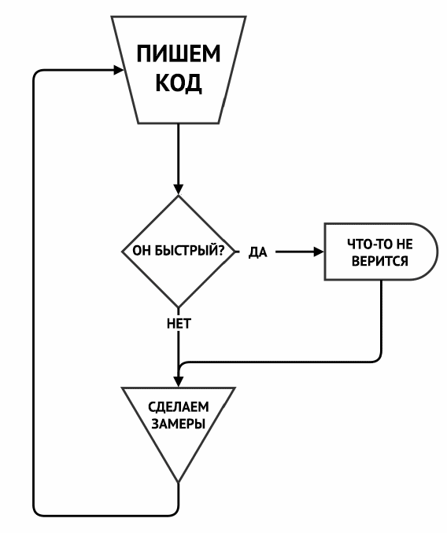

# Оптимизация

Программисты тратят огромное количество времени, размышляя и беспокоясь о некритичных местах кода, и пытаются оптимизировать их, что исключительно негативно сказывается на последующей отладке и поддержке.

## Где и как оптимизировать?

* Оптимизация без проведения замеров и снятия метрик — не более чем глупость.
* Самые значительные успехи в производительности, как правило, являются результатом оптимизации незначительных участков кода, «те самые необходимые 3%» от всего объема, которые определяются путем тщательных замеров скорости работы кода.

## Когда оптимизировать?

* В отличие от тестирования или отладки, работа над производительностью может быть отложена либо впритык к дате релиза, либо даже на период после него.
* Оптимизация имеет смысл, когда без нее невозможно завершить программу и отправить ее в релиз.

----

# Оптимизация и ошибки при оптимизации

Оптимизация кода без измерений и метрик – пустая трата времени. Основные улучшения достигаются в небольших, но важных участках кода, которые выявляются путем тщательного профилирования.

## Как определить и оптимизировать проблемы производительности?

Проблемы, как правило, уже известны и описаны. Важно следовать четким инструкциям и избегать пространных рассуждений. Например, если WidgetFactoryServer медленно работает, это может быть связано с процессорной нагрузкой, а не с ожиданиями блокировок.

Профилирование помогает найти наиболее затратные функции, оптимизация которых может значительно сократить время выполнения транзакций. Однако важно избегать необоснованных обобщений. Оптимизация одного узкого места не гарантирует аналогичного эффекта в других частях системы.

## Избегайте «народной медицины»

Программисты часто увлекаются оптимизацией, применяя удачные методы ко всем частям кода без должной проверки. Это может привести к ошибочным выводам и неоправданным действиям. Каждый раз следует заново исследовать и проверять предположения.

Опыт прошлых оптимизаций полезен, но не должен заменять научный подход. При оптимизации необходимо тщательно проверять каждое утверждение и самостоятельно проводить исследования.

- Оптимизация без измерений и метрик неэффективна.
- Основные улучшения достигаются в небольших, но важных участках кода.
- Опыт HHVM показывает, что значительное улучшение производительности можно достичь, оптимизируя код, который занимает лишь 20% процессорного времени.
- Компьютеры работают с четырьмя основными уровнями памяти, каждый из которых медленнее предыдущего: регистры и кэш процессора, ОЗУ, локальный диск, сеть.
- Проблемы с кэшированием часто сложно объяснить, так как изменения в одном участке кода могут повлиять на другой.
- В HHVM значительные улучшения достигнуты благодаря оптимизации использования кэша.
- Разработчики провели сложный анализ и сбор логов, чтобы выявить и оптимизировать функции, которые негативно влияли на производительность.
- Новые решения появляются тогда, когда стандартные подходы не помогают, и требуется самостоятельный поиск и определение проблемы.

